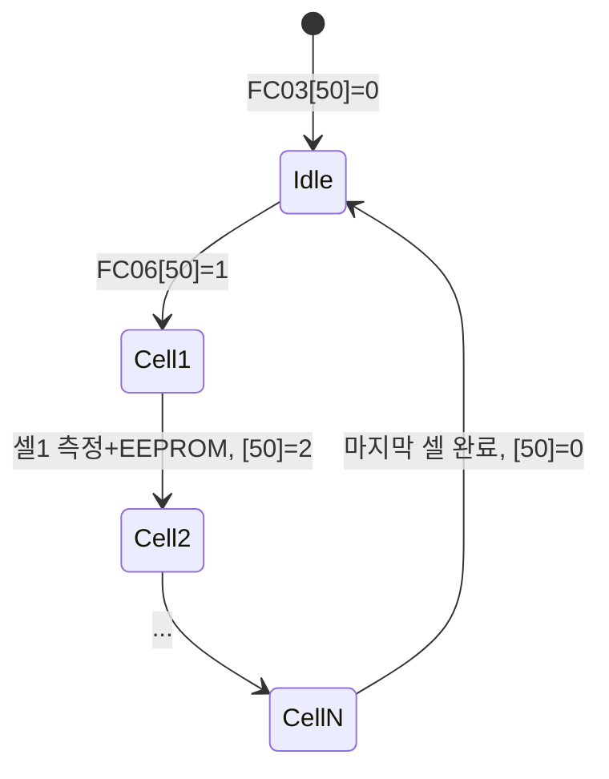

# Modbus 레지스터 주소 매핑

## 개요
| Function Code | 기능 | 설명 |
|---------------|------|------|
| **FC03** | Read Holding Registers | 설정값 읽기 |
| **FC04** | Read Input Registers | 셀전압, 온도, 전류 등 실측값 읽기 |
| **FC06** | Write Single Register | 설정값 쓰기 |

---

## FC03 (Read Holding Registers) - 설정값 읽기

| 주소 | 설명 | 단위/비고 |
|------|------|-----------|
| 0 | Modbus 주소 | 1~247 |
| 1 | 설치 셀 수 (InstalledCells) | 개 |
| 2 | 기준전압 (Max1161_RefVolt) | mV |
| 3 | 셀 게인 (Max1161_CellGain) | - |
| 4 | 셀 오프셋 (Max1161_CellOffset) | - |
| 5 | 펌웨어 메이저 버전 | - |
| 6 | 펌웨어 마이너 버전 | - |
| 7 | 펌웨어 패치 버전 | - |
| 8 | 오픈와이어 상태 (openWireStatus) | - |
| 9 | 홀 CT 사용 (UseHoleCT) | 0/1 또는 CT Ratio |
| 10 | 온도 오프셋 (TempOffset) | - |
| 11 | 전류 오프셋 (AmpereOffset) | - |
| 12 | 전류 게인 (AmpereGain) | - |
| 13 | 총전압 오프셋 (TotalVoltageOffset) | - |
| 14 | 총전압 게인 (TotalVoltageGain) | - |
| **50** | **내부저항 기준 측정 진행 상태** | FC06으로 시작; 진행 중 **1~InstalledCells**, 완료·대기 **0** (아래) |

#### 주소 50 — 진행 상태 (FC03 읽기 / FC06 쓰기)

| FC03 값 | 의미 |
|---------|------|
| **0** | 대기 또는 **전체 측정 완료** (펌웨어가 완료 후 **0**으로 설정) |
| **1 ~ 16** | **현재 측정 중인 셀 번호** (1번 셀부터 순차). `InstalledCells`보다 큰 값은 사용 안 함 |

| FC06 쓰기 | 동작 |
|-----------|------|
| **1** | **1번 셀부터** 기준 저항 스캔 시작 → 진행 레지스터를 **1**로 설정 후 셀 완료마다 **+1** |
| **0** | *(선택)* 진행 중단·클리어 (구현 시 정의) |
| 그 외 | 무시 또는 에러 |

- UI는 **FC03 주소 50**을 폴링해 진행률 표시 (예: 값 3 → 3번 셀 측정 중).
- 스캔 중 해당 셀 저항은 **EEPROM**(`baseImpendance[]`)에 저장; 완료 후 **FC04 80~95**에서 확인.
- **주기 스캔**은 별도로 **FC04 60~75**만 갱신 (EEPROM 미기록).

---

## FC04 (Read Input Registers) - 실측값 읽기

최대 **16셀** (`InstalledCells` ≤ 16). 셀 *n* (1~16)의 레지스터 주소는 **0-based**로 `n - 1` (전압), `59 + n` (스캔 저항), `79 + n` (EEPROM 저항).

| 주소 | 설명 | 단위/비고 |
|------|------|-----------|
| 0 ~ 15 | 셀 전압 | mV (실측 V × 1000, `uint16`) |
| 16 | 온도 1 (T123[0]) | 0.1°C |
| 17 | 온도 2 (T123[1]) | 0.1°C |
| 18 | 전류 (T123[2]) | 0.1A |
| 19 | 총전압 | (InstalledCells × 10 × totalVoltage × VREF / 65536) |
| 20 ~ 49, 51 ~ 59 | *(예약)* | 스캔 시각 등 (추후). **주소 50은 FC03/FC06 홀딩(진행 상태)** |
| 60 ~ 75 | 셀 내부저항 **스캔값** (실시간) | mΩ, 소수 2자리 → **정수 ×100** (아래 규칙) |
| 76 ~ 79 | *(미사용)* | - |
| 80 ~ 95 | 셀 내부저항 **EEPROM 저장값** | 동일 인코딩 (`baseImpendance[]`) |

### 내부저항 인코딩 (60~75, 80~95 공통)

| 항목 | 규칙 |
|------|------|
| 물리 단위 | **mΩ** (밀리옴) |
| Modbus 값 | `uint16` = round(mΩ × **100**), 소수점 2자리까지만 (×1000 사용 안 함) |
| 예시 | 127.87 mΩ → **12787** |
| 표현 상한 | 65535 → **655.35 mΩ** (0.655 Ω) |
| 무효/미측정 | **0** (내부저항은 양수만 유효) |

펌웨어: `z_mOhm > 0` 일 때 `value = min(65535, (uint16_t)(z_mOhm * 100.f + 0.5f))`, 그 외 0.  
UI: `표시(mΩ) = 레지스터값 / 100.0`

일반 리튬 셀 DC 내부저항은 수십~수백 mΩ 수준이므로 655 mΩ 상한으로 충분하다. Ohm 단위(별도 번지)는 현재 스펙에서 **불필요**.

| 구분 | RAM | EEPROM | FC04 읽기 |
|------|-----|--------|-----------|
| **주기 스캔** | 최신 측정값 | 갱신 안 함 | **60~75** |
| **서버 기준 측정** (FC06 **50**=**1** → 진행 **1~N**) | 60~75에도 반영 가능 | 셀 완료 시 `baseImpendance[]` | **80~95** |

UI: **FC03 50** = 진행, **FC04 60~75** = 주기 스캔, **FC04 80~95** = EEPROM 기준.

### 서버 기준 측정 시퀀스 (펌웨어)

1. **FC06 주소 50, 값 1** (대기 중 `[50]==0` 일 때만 수락 권장)  
2. **셀 1** MUX·전압·AD5940 → `baseImpendance[0]` EEPROM 반영 → **FC03[50] = 1** (측정 중 표시; 시작 직후 1)  
3. 셀 *k* 완료 후 → **FC03[50] = k** (다음 셀 측정 전/중 상태)  
4. **셀 InstalledCells**까지 반복 → 전체 `EEPROM.commit()` → **FC03[50] = 0** (완료)  
5. 주기 스캔은 병행 가능하나, **기준 스캔 중**에는 동일 SPI/AD5940 충돌 방지를 위해 **기준 스캔 우선** 권장.

---

## FC06 (Write Single Register) - 설정값 쓰기

| 주소 | 설명 | 비고 |
|------|------|------|
| 0 | Modbus 주소 | 변경 시 재부팅 |
| 1 | 설치 셀 수 (InstalledCells) | - |
| 2 | 기준전압 (Max1161_RefVolt) | mV, VREF 자동 반영 |
| 3 | 셀 게인 (Max1161_CellGain) | - |
| 4 | 셀 오프셋 (Max1161_CellOffset) | - |
| 9 | 홀 CT 사용 (UseHoleCT) | CT Ratio |
| 10 | 온도 오프셋 (TempOffset) | - |
| 11 | 전류 오프셋 (AmpereOffset) | - |
| 12 | 전류 게인 (AmpereGain) | - |
| 13 | 총전압 오프셋 (TotalVoltageOffset) | - |
| 14 | 총전압 게인 (TotalVoltageGain) | - |
| **50** | **내부저항 기준 측정 시작** | **값 = 1**: 1번 셀부터 스캔·EEPROM 저장 시작, **FC03[50]**을 1→…→N으로 증가, 완료 시 펌웨어가 **0** 설정. 진행 상태는 **FC03 주소 50**으로 읽기 |

> **참고:** FC06 Broadcast (주소 0) 지원 - ANY_SERVER로 전송 시 모든 장치에 Modbus 주소 등 설정 가능

**예시**

| 동작 | 프레임 (개념) |
|------|----------------|
| 측정 시작 | `01 06 00 32 00 01` — FC06, 주소 **50**, 값 **1** |
| 진행 확인 | `01 03 00 32 00 01` — FC03, 주소 **50** (0=완료, 3=3번 셀 중) |
| 기준값 읽기 | `01 04 00 50 00 10` — FC04, **80**부터 16워드 (저항 EEPROM) |
